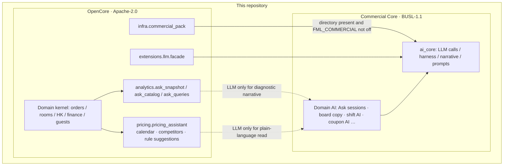

# Licensing

This repository is **dual-licensed**.

[简体中文](LICENSING_zh.md)

| Scope | License | File |
|-------|---------|------|
| **OpenCore / community edition** (default tree) | [Apache License 2.0](LICENSE) | `LICENSE` |
| **Commercial Core** | [Business Source License 1.1](LICENSE-BUSL) | `LICENSE-BUSL` |

Unless a file says otherwise, source, docs, and config are OpenCore (Apache-2.0). First-party code files carry `SPDX-License-Identifier` (`Apache-2.0` or `BUSL-1.1` under `src/commercial/`).

| Tree | License |
|------|---------|
| `src/` **except** `src/commercial/` | Apache-2.0 · OpenCore |
| `src/commercial/` (`ai_core/` + domain LLM scenes) | BUSL-1.1 · Commercial Core |

See also [NOTICE](NOTICE).



Remove `src/commercial/` or set `FML_COMMERCIAL=0` and the right-hand side does not load; OpenCore still starts.

> **Trademarks are out of scope.** See [TRADEMARK.md](TRADEMARK.md). Forks may use the code, not the 房满乐 / Fangmanle brand.

---

## Why BUSL 1.1 (not Elastic License v2)

| | BUSL 1.1 | Elastic License v2 |
|--|----------|---------------------|
| Source readable / forkable | Yes | Yes |
| Production use | Configurable (this project: Additional Use Grant = **None**) | Restricts hosted / competing SaaS, etc. |
| Converts to OSI later | **Yes** (Change License after Change Date) | **No** (stays source-available) |
| Fit with Apache OpenCore | Change License = **Apache-2.0** | Harder to fold into an Apache trunk |

Commercial Core uses BUSL so there is a commercial window, then the same Apache-2.0 as OpenCore after Change Date (or four years after first public release, whichever is earlier — see `LICENSE-BUSL`).

A separate Elastic v2 pack can be negotiated; the default commercial supplement in this tree is BUSL 1.1.

---

## OpenCore (Apache-2.0)

You may run, modify, and redistribute OpenCore in production if you follow Apache-2.0 (NOTICE, attribution of modifications, etc.). See [LICENSE](LICENSE).

---

## Commercial Core (BUSL 1.1)

Applies to [`src/commercial/`](src/commercial/) (AI runtime + **LLM scenes**) or files marked `SPDX-License-Identifier: BUSL-1.1`. See that directory’s README.

- **BUSL:** LLM calls and config, harness / narrative, Ask routing and sessions, “generate advice / plain-language read”.
- **OpenCore:** rule engines and ops kernel (pricing calendar/competitors/algorithms, snapshots, locale). Only the LLM layer lives in `commercial.*`.

Without `src/commercial/`, `from api import app` should still work. With the directory present, `FML_COMMERCIAL=0` disables the pack; AI routes return a business error that commercial AI is off.

From [`LICENSE-BUSL`](LICENSE-BUSL):

- **Licensor:** Shanghai SensePraxis Technology Co., Ltd.
- **Licensed Work:** Fangmanle Commercial Core
- **Additional Use Grant:** `None` (non-production by default; production needs a commercial license)
- **Change Date:** `2030-10-04`
- **Change License:** Apache License, Version 2.0

Sales: `commercial@fangmanle.com` or `contact@sensepraxis.com`.

---

## Contributions

OpenCore PRs are Apache-2.0. Commercial Core PRs are BUSL-1.1 (and the Change License later). See [CONTRIBUTING.md](CONTRIBUTING.md).

```
OpenCore: Apache-2.0
Commercial Core: BUSL-1.1
```
