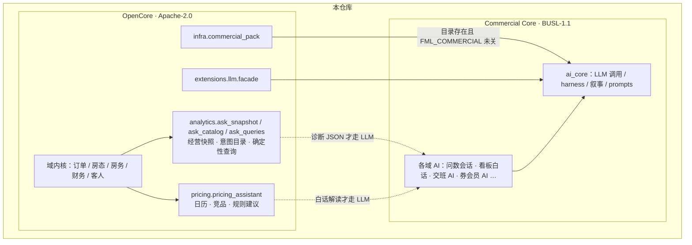

# 许可说明 · Licensing

[English](LICENSING.md) · **简体中文**

本仓库采用 **双许可（dual licensing）** 结构：

| 范围 | 许可证 | 文件 |
|------|--------|------|
| **开源版 / Community Edition**（默认仓库主体） | [Apache License 2.0](LICENSE) | `LICENSE` |
| **商业版核心 / Commercial Core** | [Business Source License 1.1](LICENSE-BUSL) | `LICENSE-BUSL` |

未另作说明的源码、文档与配置，均属于 **开源版（OpenCore）**，适用 **Apache-2.0**。一等源码顶部带 `SPDX-License-Identifier`（默认 `Apache-2.0`；`src/commercial/` 为 `BUSL-1.1`）。

| 代码树 | 许可 |
|--------|------|
| `src/`（**除** `src/commercial/`） | Apache-2.0 · OpenCore |
| `src/commercial/`（`ai_core/` + 各域 AI 场景） | BUSL-1.1 · Commercial Core |



去掉 `src/commercial/` 或设 `FML_COMMERCIAL=0` 时，上图右侧不加载，左侧仍可启动。

> **商标不在许可范围内。**「房满乐」等标识见 [`TRADEMARK_zh.md`](TRADEMARK_zh.md)；fork 可使用代码，**不得**沿用「房满乐」商标与品牌名。

---

## 为什么用 BUSL 1.1（而不是 Elastic License v2）

| | BUSL 1.1 | Elastic License v2 |
|--|----------|---------------------|
| 源码可读、可改 | 是 | 是 |
| 生产使用限制 | 可配置（本项目 Additional Use Grant = **None**） | 限制托管/竞争性 SaaS 等 |
| 到期后是否转开源 | **是**（Change Date 后转为 Change License） | **否**（始终 source-available） |
| 与 Apache 开源版衔接 | 本项目 Change License = **Apache-2.0**，到期后与开源版对齐 | 难以自动并入 Apache 开源主干 |

商业版核心选用 **BUSL 1.1**：保护商用窗口的同时，保证版本在 Change Date（或首次公开发布满四年，以较早者为准）后进入与开源版相同的 Apache-2.0。

如需 **Elastic License v2** 条款的单独物料，可联系商务另行约定；本仓库默认商业补充协议为 BUSL 1.1。

---

## 开源版（Apache-2.0）

你可以将开源版用于生产、修改、再分发，并遵循 Apache-2.0 要求（含 NOTICE / 修改声明等）。详见根目录 [`LICENSE`](LICENSE)。

---

## 商业版核心（BUSL 1.1）

适用对象：[`src/commercial/`](src/commercial/) 下模块（AI 基座 + 各域 **LLM 场景**），或文件头声明 `SPDX-License-Identifier: BUSL-1.1` 的路径。详见该目录 [`README.md`](src/commercial/README.md)。

何谓 AI 场景（商业包）：

- **纳入 BUSL**：LLM 调用与配置、harness / 叙事、问数路由与会话、各域「生成建议 / 白话解读」。
- **留在 OpenCore**：规则引擎与经营内核（如价格助手日历/竞品/建议算法、经营快照与规则 anomalies、locale 判断）。调用 LLM 的那一层才在 `commercial.*`。

去掉 `src/commercial/` 后，OpenCore 应仍能启动 API（`from api import app`）。目录仍在时可用环境变量 `FML_COMMERCIAL=0` 禁用商业包；AI 接口返回业务错误「商业 AI 能力未启用」。

当前参数（见 [`LICENSE-BUSL`](LICENSE-BUSL)）：

- **Licensor**：上海感物知行科技有限公司
- **Licensed Work**：房满乐商业版核心 (Fangmanle Commercial Core)
- **Additional Use Grant**：`None`（默认仅允许非生产使用；生产使用需购买商业许可）
- **Change Date**：`2030-10-04`
- **Change License**：Apache License, Version 2.0

商业授权 / 部署咨询：`contact@sensepraxis.com`。

---

## 贡献

向 **开源版** 提交的贡献，默认按 **Apache-2.0** 授权。  
若贡献进入 **商业版核心** 路径，贡献者同意该部分适用 **BUSL-1.1**（及其 Change Date 后的 Change License）。详见 [CONTRIBUTING_zh.md](CONTRIBUTING_zh.md)。

---

## SPDX 摘要

```
开源版: Apache-2.0
商业版核心: BUSL-1.1
```

商标与品牌：见 [`TRADEMARK_zh.md`](TRADEMARK_zh.md)（非 SPDX 软件许可）。
