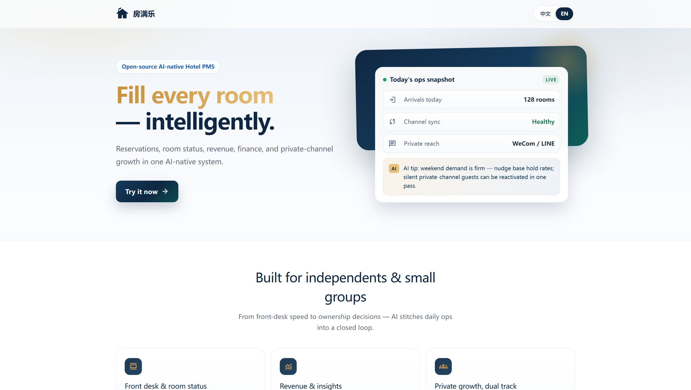
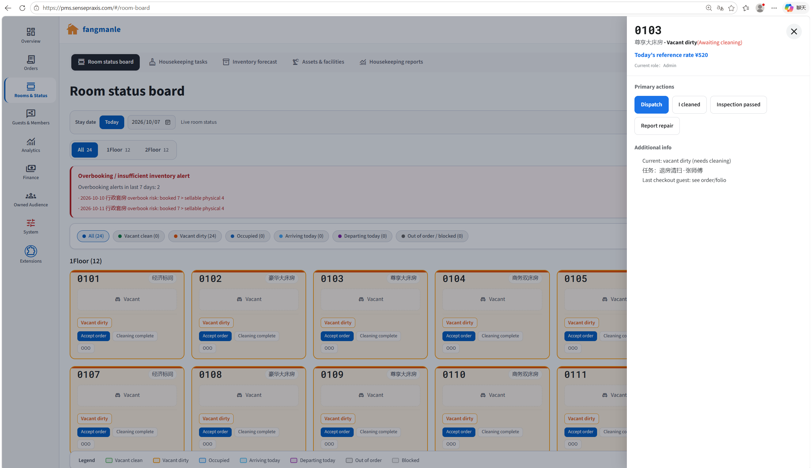
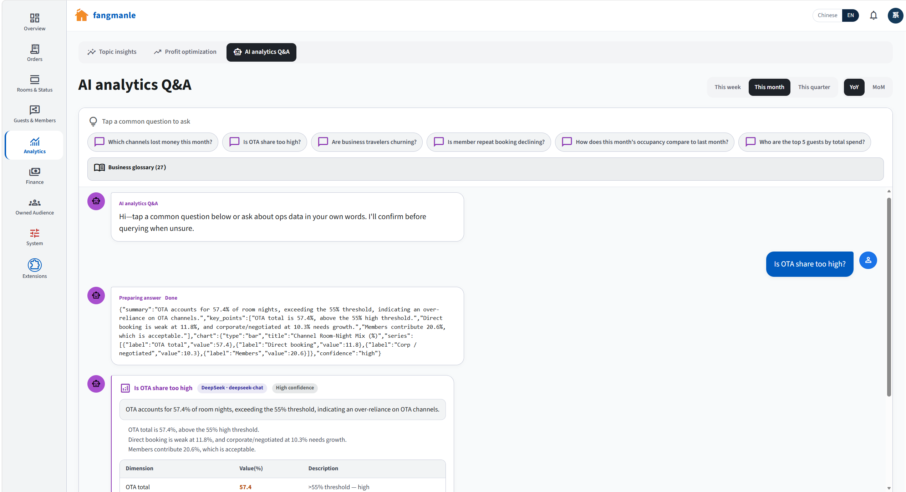
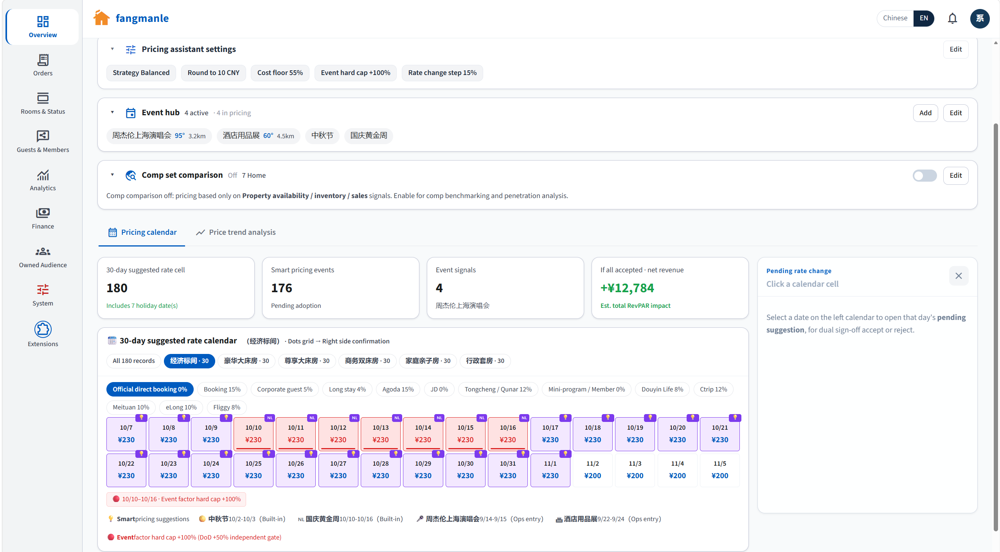
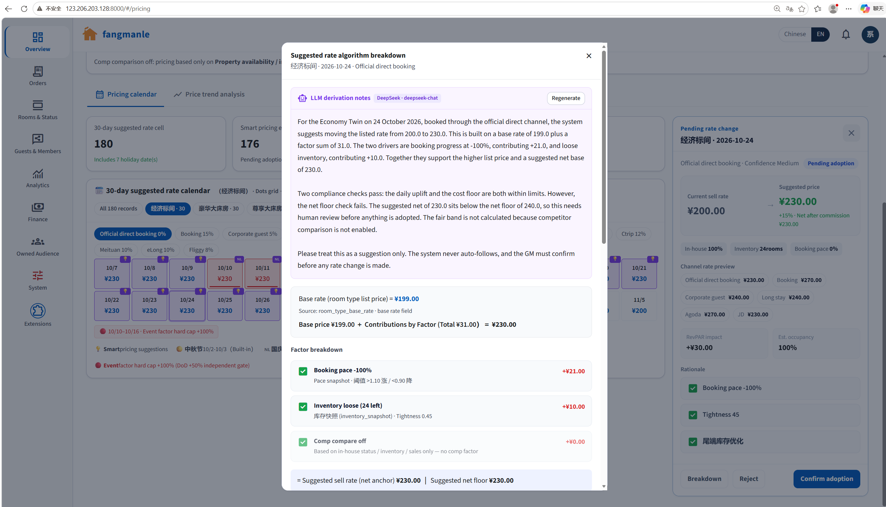
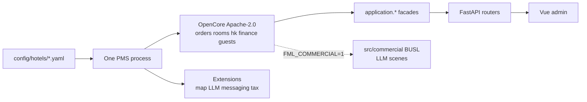

# Fangmanle PMS · AI-native open-source hotel PMS

**English** · [简体中文](README_zh.md)

[](LICENSE)
[](LICENSE-BUSL)
[](https://github.com/sensepraxis/fangmanle-ai-native-pms/releases)
[](https://github.com/sensepraxis/fangmanle-ai-native-pms/actions/workflows/ci.yml)
[](docs/COVERAGE.md)
[](https://github.com/sensepraxis/fangmanle-ai-native-pms/stargazers)
[](https://sensepraxis.github.io/fangmanle-ai-native-pms/)
[](https://pms.sensepraxis.com/)

**Docs:** [sensepraxis.github.io/fangmanle-ai-native-pms](https://sensepraxis.github.io/fangmanle-ai-native-pms/) (Quick Start · Architecture · FAQ)

**Fangmanle PMS** is an **AI-native hotel PMS** (property management system): **open source**, **self-hosted**, one process per hotel. Assemble operations from a **hotel YAML** plus **pluggable extensions** (maps, LLM, private-domain messaging, tax). Version **1.0.0** — [CHANGELOG.md](CHANGELOG.md).

### Live demo

Try the hosted seed environment (sample guests, rooms, orders — reset periodically):

| | |
|--|--|
| **URL** | [https://pms.sensepraxis.com/](https://pms.sensepraxis.com/) |
| **Login** | `admin` / `admin123` |
| **Note** | Public demo only — change passwords before any real deployment |

Prefer local? Jump to [Quick Start](#quick-start) or [INSTALL.md](INSTALL.md).

### Screenshots

English UI (switch language in the top-right of the demo). Chinese captures: [README_zh.md](README_zh.md).

| Ops overview tip | Room status |
|:---:|:---:|
|  |  |

| AI analytics Q&A | Pricing assistant |
|:---:|:---:|
|  |  |

<p align="center">
  
  <br />
  <em>Pricing assistant — AI recommendation with explainable rationale</em>
</p>

## What is Fangmanle PMS?

A **self-hosted** front-office and ops stack for a **single hotel**: rooms, orders, housekeeping, finance, guests, and optional commercial LLM scenes. OpenCore (`src/` except `commercial/`) is [Apache-2.0](LICENSE). Ask / shift AI / other LLM packs live in `src/commercial/` under [BUSL-1.1](LICENSE-BUSL). It is **hotel management software you run**, not a multi-tenant cloud PMS.

`FML_HOTEL` selects one YAML. `hotel_id` is an ownership field — it does **not** isolate a second brand in the same process. Another hotel needs another process, YAML, and `DATABASE_URL`. See [docs/FORK_AND_NEW_HOTEL.md](docs/FORK_AND_NEW_HOTEL.md).

## How to deploy Fangmanle PMS?

Local demo (SQLite, no database server): Python 3.11+, Node 20+.

```bat
deploy\dev\start.bat demo-sg
```

```bash
bash deploy/dev/start.sh demo-sg
```

Open http://127.0.0.1:8081/ — login **`admin` / `admin123`**. Production is **self-hosted PostgreSQL** via `deploy/docker/` — [INSTALL.md](INSTALL.md). Start **only** through `deploy/dev/` and `deploy/docker/`.

## Why use Fangmanle PMS?

- **Open-source hotel PMS** you can fork and run on your own machines (**self-hosted**), with English + Chinese UI via [`locales/`](locales/).
- **AI-native** where it matters: extension points for LLM, messaging, maps, and tax — OpenCore still boots with `FML_COMMERCIAL=0`.
- Domain kernel (orders / rooms / HK / finance) stays in Apache OpenCore; you are not forced into a hosted SaaS vendor for the ops core.

> Package URLs in `pyproject.toml` `[project.urls]` are upstream defaults. After a fork, point them at your own remote.

| Task | Doc |
|------|-----|
| Fork a new hotel | [docs/FORK_AND_NEW_HOTEL.md](docs/FORK_AND_NEW_HOTEL.md) |
| Extend Ask / shift / pricing without editing god-files | [docs/FRAMEWORK.md](docs/FRAMEWORK.md) |
| Hotel YAML fields | [docs/HOTEL_ASSEMBLY.md](docs/HOTEL_ASSEMBLY.md) |
| Swappable vendors | [docs/EXTENSIONS.md](docs/EXTENSIONS.md) · [VENDOR_CAPABILITIES.md](docs/VENDOR_CAPABILITIES.md) |
| Install / deploy | [INSTALL.md](INSTALL.md) · [deploy/README.md](deploy/README.md) |
| Architecture | [ARCHITECTURE.md](ARCHITECTURE.md) |
| FAQ | [FAQ.md](FAQ.md) |
| Contribute | [CONTRIBUTING.md](CONTRIBUTING.md) · [Code of Conduct](CODE_OF_CONDUCT.md) |

### Layout

| Path | Role |
|------|------|
| `config/hotels/` | One YAML per hotel |
| `src/` except `commercial/` | OpenCore (Apache-2.0) |
| `src/commercial/` | Commercial AI (BUSL-1.1) |
| `frontend/` | Admin UI |
| `deploy/dev/` · `deploy/docker/` | **Only** supported start paths (SQLite vs PostgreSQL) |
| `tools/` | CI gates, i18n, SPDX, optional offline pack |
| `db/postgres/` | Production PostgreSQL scripts (do not use root `ddl/`) |
| `locales/` | Canonical zh/en phrasebook |

`src/locales/` and `frontend/src/locales/` are generated mirrors. Edit root `locales/` only. See [docs/I18N.md](docs/I18N.md).

---

## Quick Start

**Prereqs:** Python 3.11+, Node 20+ (frontend build). SQLite needs no database server.

**Windows (full demo UI, port 8081):**

```bat
deploy\dev\start.bat demo-sg
```

Use `demo-cn` for the Chinese demo hotel. Open http://127.0.0.1:8081/ — login **`admin` / `admin123`**.

```bash
bash deploy/dev/start.sh demo-sg
```

| Goal | Command |
|------|---------|
| OpenCore only (no Ask / LLM settings / shift AI draft) | `deploy\dev\start-opencore.bat demo-sg` (or `start-opencore.sh`) |
| Hot reload after the first start | [docs/DEV.md](docs/DEV.md) — not a first-run guide |
| Docker / PostgreSQL | [INSTALL.md](INSTALL.md) · `deploy/docker/` |

Start and deploy **only** via `deploy/dev/` and `deploy/docker/`. There is no supported bypass.

SQLite is the default for local/CI. PostgreSQL is required in production (full-text / JSONB). Details: [INSTALL.md](INSTALL.md).

---

## Architecture



One hotel YAML selects channel seeds and vendors. HTTP stays `router → application.* → domain`. Routers must not import `commercial`. Full write-up: [ARCHITECTURE.md](ARCHITECTURE.md). Live OpenAPI: `/docs` — [docs/API.md](docs/API.md).

---

## Roadmap

| Horizon | Intent |
|---------|--------|
| **1.0.x** | Doc/i18n completeness, coverage gates (see [docs/COVERAGE.md](docs/COVERAGE.md)), more hotel YAML packs |
| **1.1** | Production hardening (rotate demo JWT/passwords by default, PG-first ops) |
| **Out of scope** | Multi-brand SaaS in one process |

Track shipped work in [CHANGELOG.md](CHANGELOG.md).

---

## Contributing

Please read [CONTRIBUTING.md](CONTRIBUTING.md) (PR + Conventional Commits). Security: [SECURITY.md](SECURITY.md). Chinese copies: `*_zh.md`.

---

## License · trademark

Dual license: OpenCore [Apache-2.0](LICENSE) · commercial AI [BUSL-1.1](LICENSE-BUSL). See [LICENSING.md](LICENSING.md) and [NOTICE](NOTICE).  
Trademarks are **not** licensed with the code: [TRADEMARK.md](TRADEMARK.md). Forks must not keep the **房满乐 / Fangmanle** product brand.  
Commercial licensing: `contact@sensepraxis.com`.
