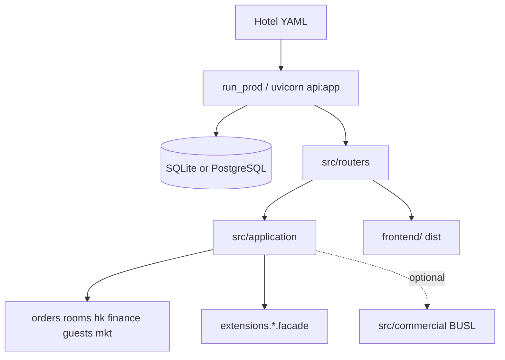

> Canonical source in the repository: [`ARCHITECTURE.md`](https://github.com/sensepraxis/fangmanle-ai-native-pms/blob/main/ARCHITECTURE.md). Edit that file and re-run `python tools/sync_website_docs.py` (CI does this automatically).

[简体中文 context maps](https://github.com/sensepraxis/fangmanle-ai-native-pms/blob/main/docs/BOUNDED_CONTEXTS.md) · [extension points](https://github.com/sensepraxis/fangmanle-ai-native-pms/blob/main/docs/FRAMEWORK.md)

## Overview

Fangmanle is a **single-hotel process**. Startup reads `config/hotels/<FML_HOTEL>.yaml`, binds extensions (map, LLM, messaging, tax), and serves one FastAPI app plus the Vue admin.

## Modules

| Context | Package | Stable entry |
|---------|---------|----------------|
| Orders / stay / folio | `orders/` | `application.orders` |
| Finance (AR, deposit, refund, night audit) | `finance/` | `application.finance` |
| Rooms / inventory | `rooms/` | `application.rooms` |
| Housekeeping | `hk/` | `application.hk` |
| Marketing / coupons | `mkt/` | `application.mkt` |
| Private-domain messaging | `messaging/`, `extensions/messaging` | `messaging.get_channel()` |
| WeCom adapter | `wecom/` | WeCom-only (JS-SDK / callback) |
| Guests / CRM | `guests/` | `application.guests` |
| Ask kernel (no LLM session) | `analytics/` | catalog / queries / snapshot |
| Commercial LLM scenes | `commercial/` | via `infra.commercial_pack` only |

HTTP rule: **`router → application.* → service`**. CI: `python tools/check_router_layer.py`.

## Data flow

1. Browser → FastAPI (`src/api.py` mounts domain routers).
2. Auth/JWT (`infra.auth_local`) + `hotel_scope`.
3. Facade writes domain tables; cross-context via facade, domain events, or read-only query objects — not service-to-service table writes.
4. Night audit / webhooks: event bus (`events.integration`) may fan out to messaging channels.

Persistence: SQLAlchemy 2 models, `DATABASE_URL` selects SQLite (dev/CI) or PostgreSQL (production). PII encryption at rest where implemented.

## Decisions

| Decision | Why |
|----------|-----|
| One process, one hotel | Operational simplicity; no fake multi-tenant isolation via `hotel_id` |
| Dual license split | Kernel stays Apache; LLM product scenes stay BUSL |
| SQLite + PostgreSQL same models | Zero-dep CI and demos; PG for production features |
| Hotel YAML + extensions | Region vendors (maps, tax, LINE vs WeCom) without `if hotel ==` in god files |
| No Redis in the default stack | No cache/queue dependency in OpenCore runtime today |
| FastAPI OpenAPI | Live `/docs` and `/openapi.json` — [docs/API.md](https://github.com/sensepraxis/fangmanle-ai-native-pms/blob/main/docs/API.md) |
